# Flicker Stitch — Assembly Instructions

Stitch a working circuit onto fabric. In this kit you sew small electronics
onto an embroidered badge using **conductive thread**, and when you flip the
switch, the LEDs light up.

By [@borisnotes](https://borisnotes.com)

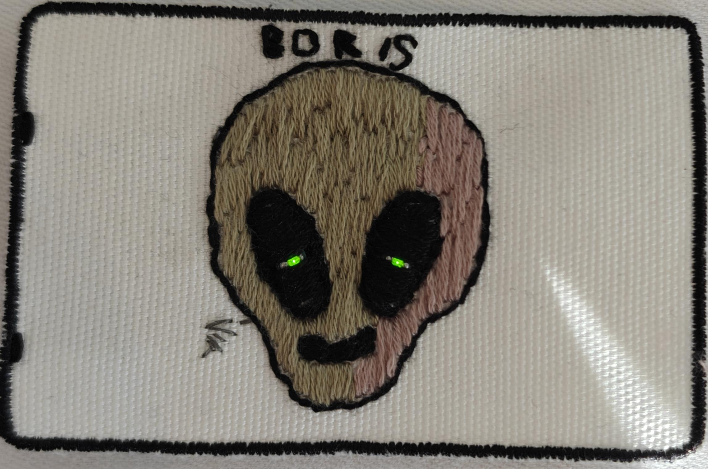

---

## 1. What's in the bag

| # | Item | Qty |
|---|------|-----|
| 1 | Canvas | 1 |
| 2 | Design paper | 1 |
| 3 | Needle | 1 |
| 4 | Needle threader | 1 |
| 5 | Conductive thread | 1 |
| 6 | Outline thread (black) | 1 |
| 7 | Colour thread 1 | 1 |
| 8 | Colour thread 2 | 1 |
| 9 | Battery module with switch | 1 |
| 10 | Blinky LED module | 2 |
| 11 | Brooch pin | 1 |
| 12 | CR2032 coin cell | 1 |

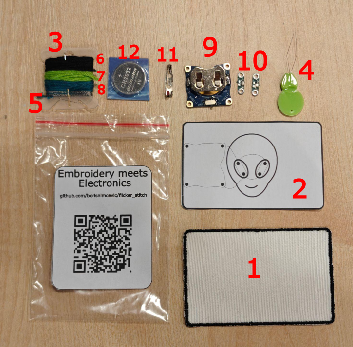

> **Not in the bag, but useful:** good light, a flat table, a small pair of
> scissors, clear nail polish (optional, for sealing knots).

---

## 2. How the electronics work

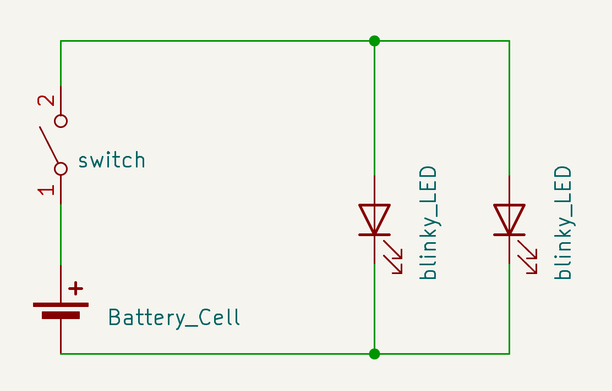

Electricity needs a **loop**. It leaves one side of the battery, passes through
the parts, and comes back to the other side. If the loop is broken anywhere,
nothing lights up.

The circuit in this kit is just a battery, a switch and two blinky LEDs:

- **Battery (CR2032)** — the power source, 3 V. It has a **+** side and a
  **–** side.
- **Switch** — opens and closes the loop. Off means the loop is open.
- **Blinky LED modules (×2)** — each one has a tiny chip inside that turns its
  LED on and off by itself. They only work **one way round**: current must go
  in the **+** side and out the **–** side. The resistor that protects the LED
  is already on the module, so you don't need any extra parts.
- **Conductive thread** — the wires. Each line of stitching carries current
  from one pad to the next.

Follow the lines on the schematic:

1. From the battery **+**, current goes through the **switch**.
2. After the switch it reaches a junction (the top green dot) that feeds
   **both LEDs at once**. This is called wiring in *parallel*, so each LED gets
   the full battery voltage and blinks on its own.
3. Both LEDs return to the battery **–** through a second junction (the bottom
   green dot), which closes the loop.

### Two rules for the thread

1. **+ and – must never touch.** If two stitches from opposite sides of the
   battery touch, the current takes a shortcut and the LEDs stay dark (and the
   battery drains).
2. **Every joint needs contact.** The thread has to actually touch the metal
   pad, and be pulled snug against it.

### Where everything goes

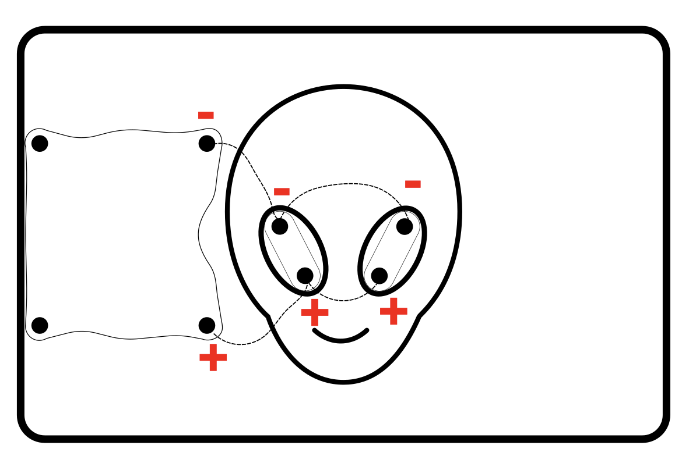

The design paper in your bag shows this same layout.

The dashed lines are the conductive thread. The red **+** and **–** marks show
the polarity of each pad:

- The **battery module** sits on the left. Its top pad is **–** and its
  bottom pad is **+**.
- The two **blinky LED modules** sit in the alien's eyes. On each one, the
  top pad is **–** and the bottom pad is **+**.
- All the **–** pads are joined by one line of thread, and all the **+** pads
  are joined by another. The two lines never cross or touch.

---

## 3. Threading the needle

1. **Cut about 20 cm** of conductive thread. Longer is not better; it
   tangles and frays.
2. Thread the needle with the **needle threader** (see below). If the thread
   won't go, snip the end at a sharp angle to remove loose fibres. Wetting
   the tip helps.
3. Pull it through until you have about **2 cm** on the short side. This way
   you can hold it with the same fingers that hold the needle.
4. **Tie a knot** at the long end. This is the anchor that stops the thread
   pulling through.

### Tying the knot

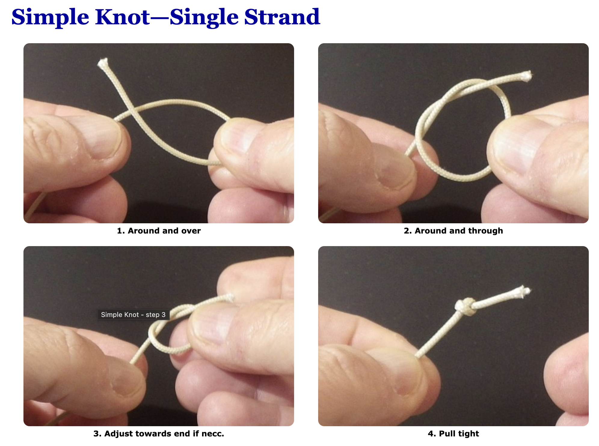

1. Make a loop around your finger.
2. Roll the thread off your fingertip so it twists into a small coil.
3. Pinch the coil and pull the thread through to the end. A small, firm knot
   forms.
4. Snip off the tail, leaving ~3 mm.

> **Tip:** conductive thread is slippery. Make the knot a double knot.

### Using the needle threader

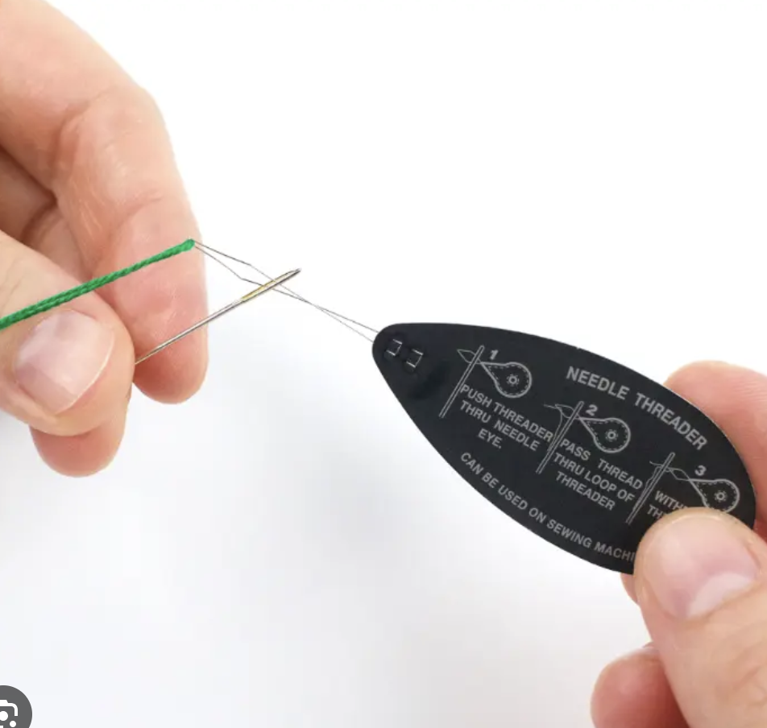

1. Push the wire loop of the threader through the eye of the needle.
2. Pass the end of the thread through the wire loop.
3. Pull the threader back out. The thread comes through the eye with it.

---

## 4. Running stitch: connecting the parts

A **running stitch** is the simplest stitch: the needle goes down, up, down,
up, in a dotted line. It's how you'll draw each "wire".

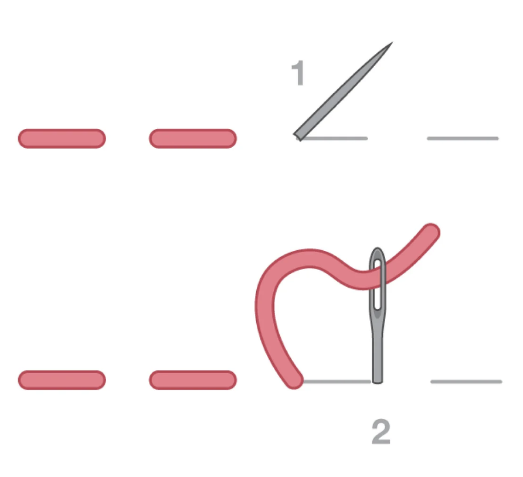

### Place the parts

Use the **design paper** (item 2) as your map. It shows where everything goes.

1. Lay the design paper next to the canvas, so you can compare them.
2. Put the **battery module** on the canvas on the left, where the paper shows
   it, with the switch facing up TODO: confirm.
3. Put one **blinky LED module** in each of the alien's eyes.
4. Check the **+** and **–** marks against the polarity picture in section 2.
   The **–** pads are at the top and the **+** pads at the bottom.
5. Hold each part still with a finger while you stitch its first pad.

### The basic motion

1. Bring the needle **up** from the back of the fabric.
2. Take the needle **down**, a short distance ahead (3–5 mm).
3. Bring it **up** again, one stitch-length further.
4. Repeat. The thread shows as dashes on the front, and as longer dashes on
   the back.

Keep stitches small and even, and pull the thread **snug but not tight**, so the
fabric doesn't pucker.

### Stitching to a pad

1. Start with the knot on the **back**, near the first pad.
2. Bring the needle up through the **hole** in the pad.
3. Go back down through the same hole, then up again. Do this **2–3 times**,
   pulling snug each time. This wraps the thread on the metal for a solid
   contact.
4. Now run stitches along the path to the next pad, following the lines
   on the canvas.
5. At the next pad, wrap through the hole **2–3 times** again.

### Ending a thread

1. Finish with a wrap through the last pad.
2. Take the needle to the **back**, and tie a double knot close to the fabric.
3. Trim the tail, so it can't touch another line.

---

## 5. Test it

1. Push the **CR2032 coin cell** into the holder on the battery module, with
   the **+** side facing up.
2. Slide the switch to **ON**.
3. The LEDs should light or start blinking.

---

## 6. Back stitch: outlining with the black thread

The **black thread** is for decoration only: it draws the outline of the
alien's head, the eyes and the mouth. It does not carry electricity. Use a **back
stitch**, which makes a solid, unbroken line.

### Prepare the thread

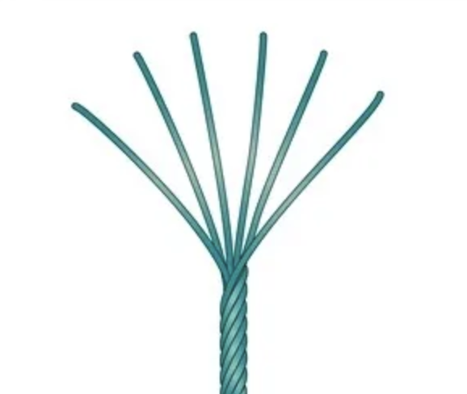

1. Cut about **40 cm** of black thread. It is made of **6 thin strands** twisted
   together.
2. Hold the end and gently pull **one strand** out. Pull it slowly and let the
   other five slide free, so they don't knot.
3. Thread the needle with the single strand (use the needle threader again).
4. Pull the strand through until both ends are **the same length**. The thread
   is now doubled: the **needle is on the fold** at one end.
5. **Tie a knot** in the two loose ends together. Now you have a doubled thread
   with the needle on one end and the knot on the other.

### The back stitch

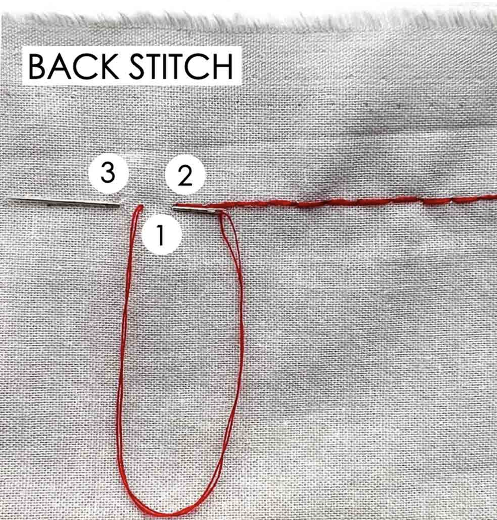

1. Bring the needle **up** from the back, one stitch-length ahead of where you
   want the line to start (**1**).
2. Take the needle **down** at the start of the line, going back to meet the
   previous stitch (**2**). This makes the first stitch.
3. Bring the needle **up** again, one stitch-length ahead of the last hole
   (**3**).
4. Take the needle **down** in the hole where the last stitch ended. Repeat,
   always stepping forward and then going back.

Keep the stitches short (about 2–3 mm) and the same size. Pull the thread snug
but not tight so the fabric doesn't pucker.

### Where to stitch

Follow the printed lines on the canvas: the outline of the alien's head, the
eyes and the mouth. Take care not to stitch over the pads or the conductive thread.

### Ending the thread

1. Take the needle to the **back**.
2. Pass it under a few stitches, and tie a knot close to the fabric.
3. Trim the tail.

---

## 7. Satin stitch: colouring in the alien

Now fill the alien's head with colour, using **colour thread 1**. The colour threads
are for decoration only, like the black thread. Use a **satin stitch**: many straight
stitches laid side by side, so that no fabric shows through.

### Prepare the thread

1. Cut about **40 cm** of colour thread. It is made of **6 thin strands**
   twisted together.
2. Pull **2 strands** out together, slowly, and let the other four slide free.
3. Thread the needle with the two strands (use the needle threader if you need
   it).
4. Pull the strands through until both ends are **the same length**. The
   thread is now folded in half, with the **needle on the fold**.
5. **Tie a knot** in the loose ends. You are now stitching with **4 strands**
   (2 strands, doubled).

### The satin stitch

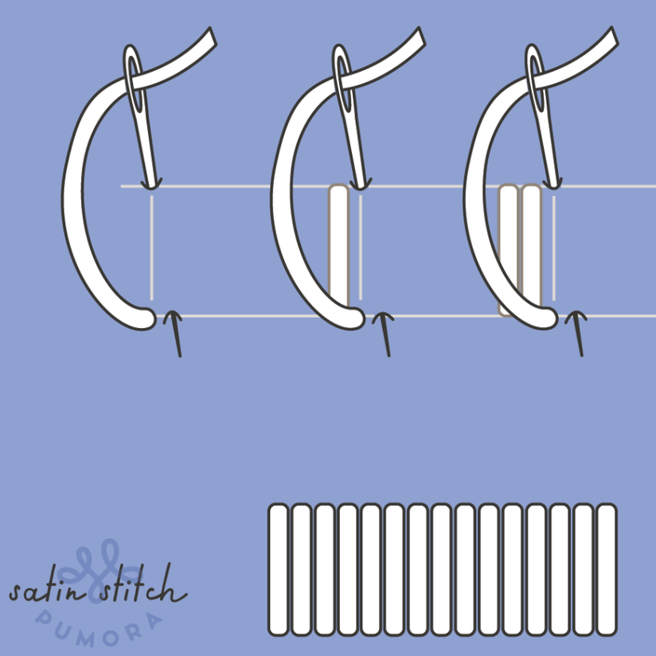

1. Bring the needle **up** from the back at one edge of the area you are
   filling.
2. Take the needle **down** at the opposite edge, straight across the shape.
3. Bring the needle **up** again right next to where you came up the first
   time, and go **down** right next to the last hole on the other side.
4. Repeat, laying each stitch tight against the one before it, until the area
   is covered.

Keep the stitches parallel and close together, and pull each one snug but not
tight so the fabric doesn't pucker. Stitch right up to the black outline, and
take care not to cover the pads or the conductive thread.

### Ending the thread

1. Take the needle to the **back**.
2. Pass it under a few stitches, and tie a knot close to the fabric.
3. Trim the tail.

---

## 8. Shading with the second colour

Finish the picture by adding shading with **colour thread 2**. Use the same
**satin stitch** as in the last step.

1. Prepare a new thread exactly as before: about **40 cm**, 2 strands, folded
   in half, with a knot at the end.
2. Stitch satin stitches with colour thread 2 on the areas you want to shade.
   Make the stitches **different lengths** and slide them in **between** the
   colour 1 stitches, so the two colours blend into each other, as in the
   photo below.
3. Keep the stitches parallel and close together, and stay clear of the pads
   and the conductive thread.
4. End the thread on the back: pass the needle under a few stitches, tie a
   knot close to the fabric, and trim the tail.

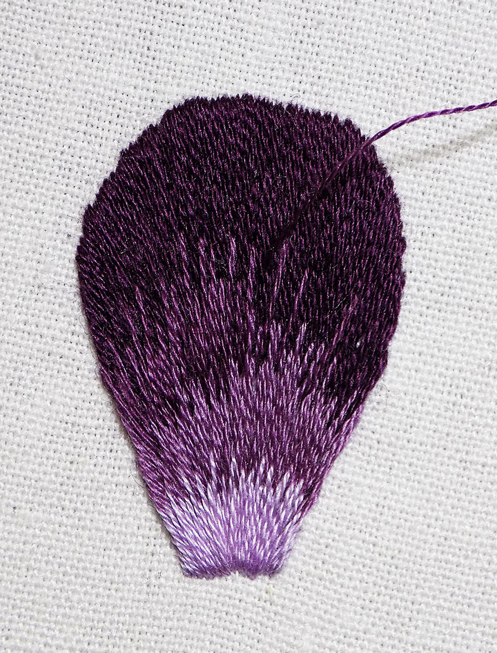

Your badge is finished.

---

## 9. Optional: attach the badge

### As a brooch

1. Place the **brooch pin** on the back of the badge, near the top.
2. Prepare **black thread** as you did for the outline: 1 strand, folded in
   half, with a knot at the end.
3. Sew through each hole of the pin and the canvas with a few tight stitches.
4. Tie a knot on the back, and trim the tail.

### Or sew it onto something

You don't need the pin. Sew the badge straight onto a jacket, bag or other
garment with a running stitch around the edge of the canvas.

